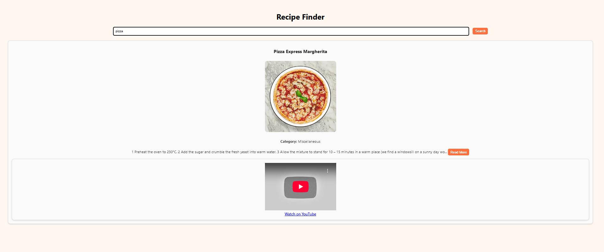
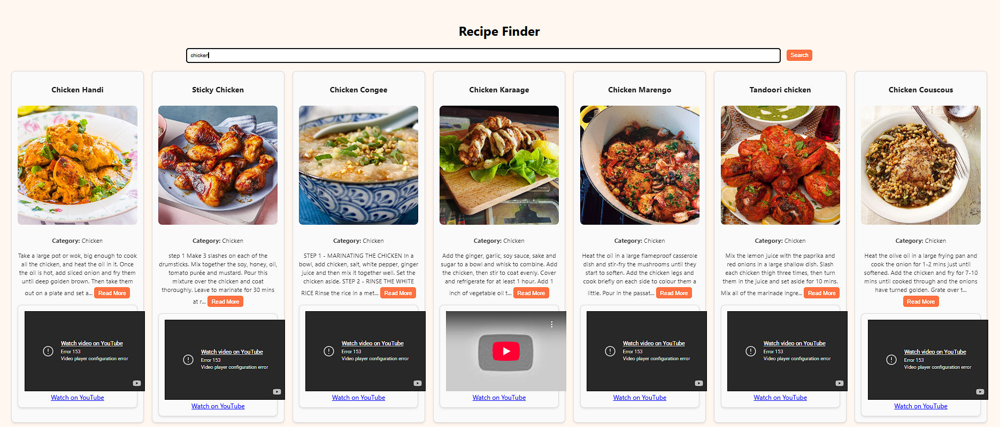

<h1 align="center">🍽️ <i>Recipe Finder</i></h1>
A simple and lightweight web application to search for food recipes using the TheMealDB API.  
This app allows users to enter any recipe name and instantly fetches details including an image, category, YouTube tutorial, and expandable instructions.

---

## ✨ Features
- **Search recipes** by name  
- Displays **recipe image**  
- Shows **category**  
- Provides **YouTube tutorial link**  
- **Expandable instructions** using a *Read More* / *Read Less* feature  

---

## 🚀 Technologies Used
- **HTML5**
- **CSS3**
- **JavaScript (Fetch API)**
- **TheMealDB API**
  

 
--- 

## 📁 Project Structure 
```
recipe_finder/
│
├──images/
│   ├──intro.png
│   ├──example1.png
│   └──example2.png
│
├──README.md
├──index.html
├──script.js
└──style.css    
  
--- 
 
 ## 🚀 Getting Started 
 ### Option1 : view live 
👉 [Live Demo](https://Snehakandala0101.github.io/recipe_finder/) 
### Option2 : Run locally 
1.	**Download** or **clone** the repository: 
    ```bash 
    git clone https://github.com/kandalasneha/recipe_finder.git  
2.	Open the folder: 
     ```bash           
      cd recipe_finder 
3.	Open index.html in your browser   
--- 
   
## 🔗 API Reference  
  **TheMealDB API**   
👉 https://www.themealdb.com/api.php 
   
TheMealDB is a free and open online database for food recipes. It provides access to detailed meal information including:   
-	Ingredients and measurements   
-	Cooking instructions   
-	Meal category and region   
-	Recipe thumbnails and YouTube video tutorials   
   
This project uses TheMealDB’s public search endpoint:   
   
https://www.themealdb.com/api/json/v1/1/search.php?s=<meal name>   
Example: https://www.themealdb.com/api/json/v1/1/search.php?s=pizza

--- 
## Preview 
 
 
 


  
  
--- 
## Future Enhancements
- Add filters for category or region
- Save favorite recipes
- Add dark/light theme toggle
 
--- 
 
 
## Author   
**Sneha Kandala** 

Passionate about web development and AI integration.
   


